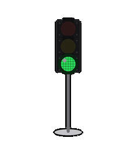

# Cursor 状态红绿灯

在 Windows 桌面显示一个可拖动的「红绿灯」，实时反映 Cursor Agent 的工作状态。

## 灯色含义

| 灯 | 状态 | 说明 |
|----|------|------|
| 黄 | 执行中 | 发消息、用工具、改文件、思考等 |
| 绿 | 完成 | 任务结束或空闲 |
| 红 | 失败 | 工具执行失败（持续约 1 秒以上才亮红，避免重试时闪一下） |

**多窗口**：每个 Cursor 会话单独记录状态，任意一个在忙就显示黄灯，全部结束才绿灯。

## 环境要求

- Windows 10/11
- [Python 3.8+](https://www.python.org/downloads/)（安装时勾选 *Add to PATH*）
- [Cursor](https://cursor.com/) 支持 Hooks 的版本

## 一键安装（推荐，首次使用）

1. 克隆本仓库
2. **双击 `install.bat`**（安装依赖 + 复制文件到 `%USERPROFILE%\.cursor`）
3. **完全退出并重启 Cursor**
4. 双击 **「Cursor红绿灯-启动」** 或 `run_cursor_light.bat`